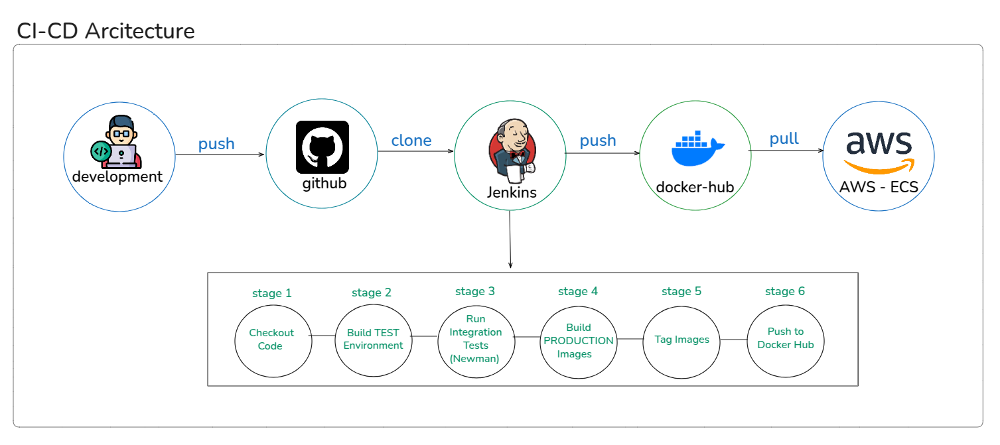
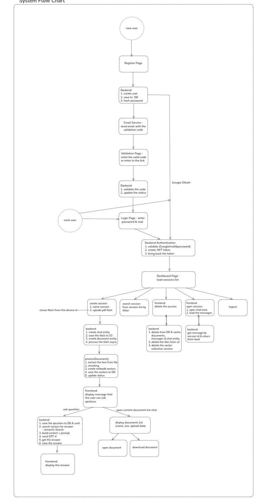

# 🤖 Smart Document Chat

### AI-Powered Document Chat Platform with RAG Technology

---

## 🌐 Live Website

**[https://smart-document-chat.com](https://smart-document-chat.com)**

---

## 📖 Project Description

**Smart Document Chat** is an advanced platform that enables users to conduct intelligent conversations with documents using AI and RAG (Retrieval-Augmented Generation) technology. The system uploads documents, analyzes their content, and allows users to ask questions and receive accurate answers based on document content.

### 🎯 Project Goals

Creating an advanced and accessible solution for document information management through:
- Smart document processing with AI
- Advanced semantic search
- Intuitive user interface
- Secure and scalable cloud infrastructure

---

## 🚀 Technologies

### Backend
- **Spring Boot 3.3.4** - Main framework for Backend development
- **Java 21** - Programming language
- **Spring Security + JWT** - Authentication and authorization
- **Spring Data JPA** - Database management
- **PostgreSQL** - Relational database
- **Redis** - Caching for improved performance
- **LangChain4j** - Integration with OpenAI and NLP
- **Qdrant** - Vector Database for semantic search
- **AWS S3** - Cloud document storage
- **Apache PDFBox** - PDF file processing
- **MapStruct** - Automatic object mapping
- **Lombok** - Reduce boilerplate code

### Frontend
- **React 18.2** - JavaScript library for building UI
- **React Router** - Navigation between pages
- **Axios** - HTTP communication with Backend
- **CSS3** - Modern and responsive design

### DevOps & Infrastructure
- **Docker & Docker Compose** - Containerization
- **Jenkins** - Automated CI/CD
- **Nginx** - Reverse proxy and Load balancing
- **Let's Encrypt** - SSL certificates
- **AWS EC2** - Cloud servers
- **Newman** - Automated API testing

### Authentication & Integration
- **Google OAuth 2.0** - Google account login
- **JavaMail** - Email sending (user verification)

---

## ✨ Features and Benefits

### 🔐 Security and Authentication
- **Secure login** with JWT Tokens
- **Google OAuth 2.0 authentication** for quick login
- **Email verification** for enhanced security
- **Role-based permissions**

### 📄 Document Management
- **Document upload** - Support for PDF files
- **Automatic processing** - Chunking and embedding generation
- **Cloud storage** - Secure storage in AWS S3
- **Status tracking** - Real-time processing status monitoring

### 💬 Smart Conversations
- **RAG (Retrieval-Augmented Generation)** - Accurate answers from documents
- **Context preservation** - System remembers conversation history
- **Confidence score** - Confidence rating for each answer
- **Sources** - Display exact sources from documents
- **Multilingual support** - Answers in question language (Hebrew/English)

### ⚡ Performance
- **Redis Caching** - Cache for accelerating repeated queries
- **Lazy Loading** - Efficient data loading
- **Optimized Queries** - Optimized database queries
- **Async Processing** - Asynchronous processing for large documents

### 🎨 User Experience
- **Intuitive interface** - Clean and simple design
- **Responsive Design** - Adapts to all screen sizes
- **Real-time notifications** - Updates on system operations
- **Multiple chat management** - Ability to manage multiple chats simultaneously

---

## 🏗️ Architectures

### 1️⃣ CI/CD Architecture

**CI/CD Process:**
1. **Push to GitHub** - Developer uploads new code
2. **Jenkins Webhook** - Automatically triggers Pipeline
3. **Build & Test** - Build test environment and run Newman tests
4. **Quality Gate** - If tests pass, continue to production
5. **Production Build** - Build clean images without TEST_MODE
6. **Tagging** - Tag with commit message and version
7. **Push to Registry** - Upload to Docker Hub
8. **Manual Deploy** - Pull new images to AWS

**Benefits:**
- ✅ Full automation from code to deployment
- ✅ Automated testing before each deploy
- ✅ Tagged versions for each commit
- ✅ Quick rollback in case of issues

---

### 2️⃣ AWS Architecture

**AWS Components:**

1. **EC2 Instance** - Virtual server for running the application
2. **Route 53** - DNS management for smart-document-chat.com domain
3. **S3 Bucket** - Storage for user documents
4. **Security Groups** - Firewall for server protection
5. **Elastic IP** - Fixed IP address for server
6. **Let's Encrypt** - Free SSL certificates with automatic renewal

**Traffic Flow:**
1. User accesses https://smart-document-chat.com
2. Nginx receives request and performs SSL termination
3. API requests are forwarded to Backend (Spring Boot)
4. Frontend requests are forwarded to React Container
5. Backend communicates with PostgreSQL, Redis, Qdrant, and S3

---

## 📊 System Flow Diagram

**Flow Description:**

1. **Registration and Verification:**
   - User registers and receives verification code via email
   - Code verification enables login

2. **Login:**
   - Username/Password or Google OAuth
   - Receive JWT Token for future authentication

3. **Create New Chat:**
   - Upload PDF
   - Automatic background processing
   - Wait for READY status

4. **Questions and Answers:**
   - Ask questions from documents
   - Semantic search in RAG
   - Receive answers with sources

5. **Document Management:**
   - View documents
   - Download documents

---

## 🎓 Learning from the Project

This project demonstrates:

### Backend Skills
- ✅ Spring Boot ecosystem (Security, JPA, Caching)
- ✅ JWT Authentication & OAuth 2.0
- ✅ Vector Databases & RAG
- ✅ AWS S3 Integration
- ✅ Redis Caching Strategy
- ✅ Clean Architecture & Design Patterns
- ✅ Exception Handling & Validation
- ✅ API Design (RESTful)

### DevOps Skills
- ✅ Docker & Docker Compose
- ✅ Jenkins CI/CD Pipeline
- ✅ Automated Testing (Newman/Postman)
- ✅ AWS Deployment
- ✅ Nginx Configuration
- ✅ SSL/TLS Setup
- ✅ Container Registry Management

### AI/ML Skills
- ✅ RAG Architecture
- ✅ LangChain4j Framework
- ✅ Vector Embeddings
- ✅ Semantic Search
- ✅ Prompt Engineering
- ✅ AI Integration Best Practices

---

## 📧 Contact

**Ester Ovrani**
- 📧 Email: ester.ovrani@gmail.com
- 💼 Portfolio: [smart-document-chat.com](https://smart-document-chat.com)

---

## 📄 License

This project is created for portfolio purposes.

---

  
<strong>Built with ❤️ by Ester Ovrani</strong>

  

    <a href="https://smart-document-chat.com">🌐 Visit Live Site</a>
  

